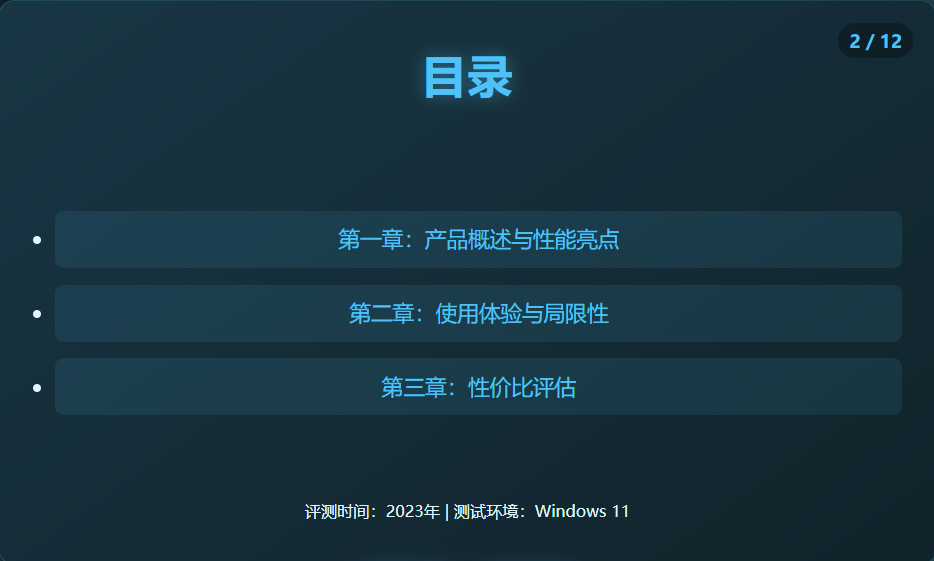
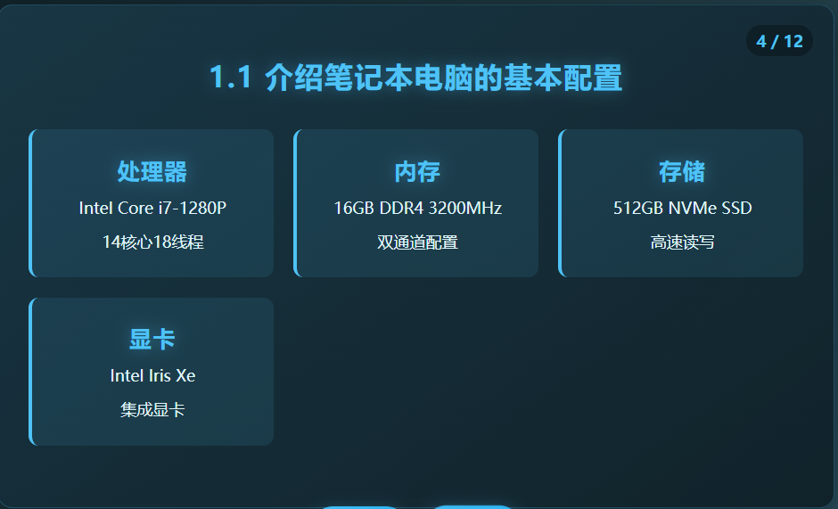
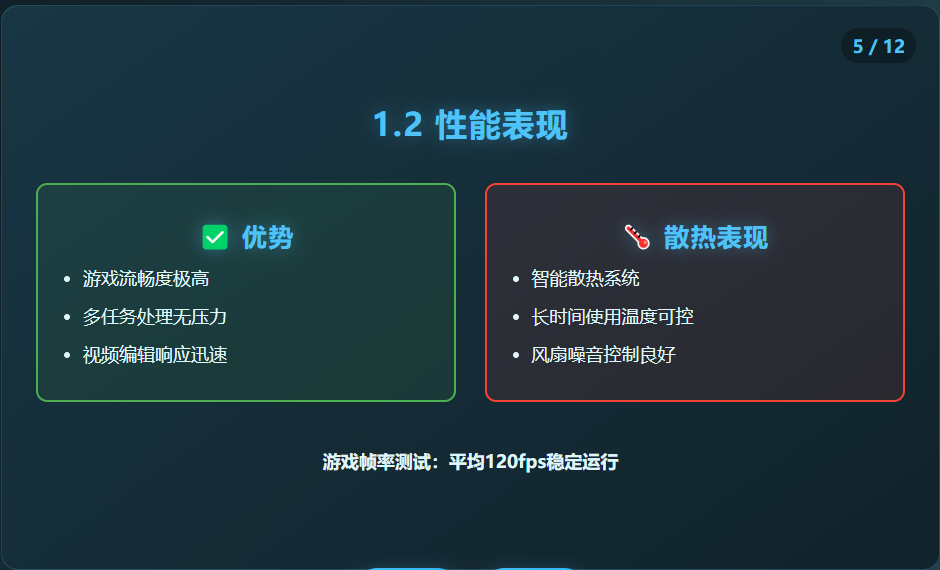
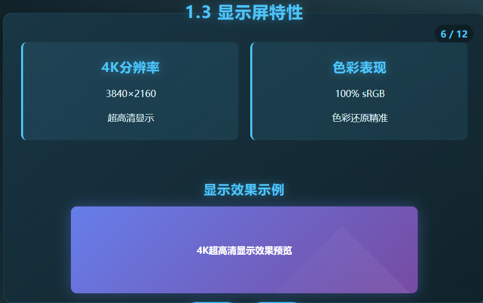
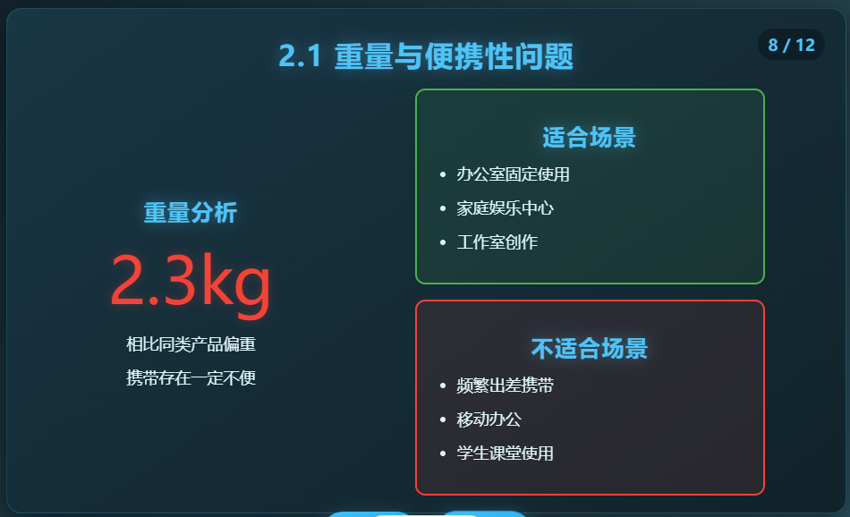
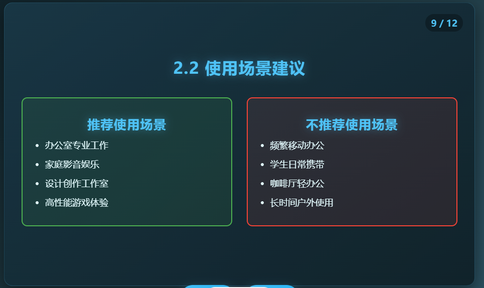
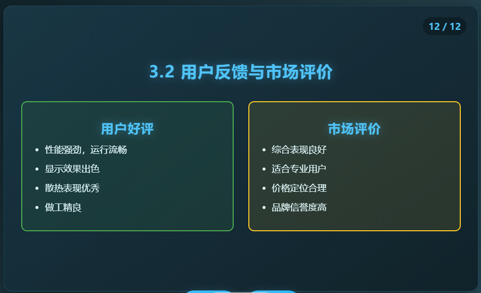
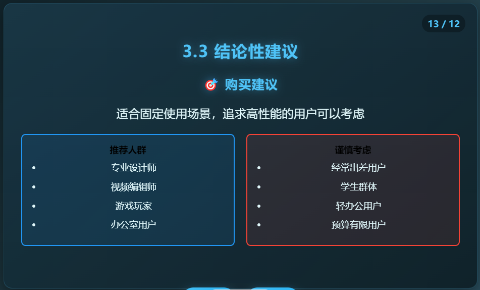

# AI-agent-PPT-Generator 


## 快速开始代码示例 

```python 
# 导入PPT生成器 
from ppt_generator import PPTGenerator 

# 初始化生成器 
generator = PPTGenerator() 

# 准备输入文本 
input_text = """ 
这款笔记本电脑性能很强，打游戏非常流畅，散热也不错。 
但是重量有点重，携带不方便，适合固定场所使用。 
总体来说性价比还可以。 

笔记本电脑采用了最新的处理器，内存容量大，存储空间充裕。 
屏幕分辨率高，显示效果细腻。 
散热系统经过优化，长时间使用也不会过热。 
"""

# 生成PPT 
ppt_path = generator.generate( 
    text=input_text, 
    title="笔记本电脑性能分析", 
    style="professional",  # 可选: professional, creative, minimal 
    use_cloud_enhance=True  # 使用云端增强获得更好效果 
)

print(f"PPT已成功生成: {ppt_path}") 
``` 

## 项目简介

AI-agent-PPT-Generator 是一个基于人工智能技术的演示文稿自动生成工具，只需输入主题，即可生成风格多样的PPT。该项目利用先进的AI agent技术，实现了从大纲生成、内容填充到排版美化的全流程自动化，极大地提升了演示文稿的创作效率。

## 核心功能

### 📋 智能大纲生成
- 基于输入主题自动创建逻辑清晰、结构合理的演示文稿大纲
- 支持自定义大纲深度和详细程度
- 可根据不同场景（商务、学术、教育等）调整大纲风格

### 🎨 智能排版设计
- 自动为PPT页面分配合适的布局和设计元素
- 支持多种预设风格模板（专业、创意、简约等）
- 自动调整文本、图片位置，确保视觉美观

### 📝 内容智能生成
- 基于大纲自动生成各章节详细内容
- 支持添加相关案例、数据和图表建议
- 可根据目标受众优化内容表达方式

### 🏠 本地部署支持
- 完整支持本地运行环境搭建
- 支持离线运行（有限功能）

### 🌐 云端增强集成
- 可将本地agent生成的文本发送至线上大模型进行质量优化
- 支持多种主流大模型API集成
- 提供智能内容润色和风格优化功能

## 系统架构

### 架构概览

AI-agent-PPT-Generator采用分层架构设计，包含用户界面层、核心服务层、AI引擎层和数据层四个主要层级。系统架构注重模块间的解耦，确保各组件能够独立演化和扩展，同时保持良好的协作关系。

```
┌─────────────────────────────────────────────────────────────────────────────────┐
│                      用户界面层 (UI Layer)                                      │
│  ┌───────────────┐  ┌───────────────┐  ┌─────────────────────────────────────┐  │
│  │    Web界面    │  │  命令行工具   │  │            API接口                  │  │
│  └───────────────┘  └───────────────┘  └─────────────────────────────────────┘  │
└─────────────────────────────────────────────────────────────────────────────────┘
                                      │
┌─────────────────────────────────────▼───────────────────────────────────────────┐
│                      核心服务层 (Core Services)                                 │
│  ┌───────────────┐    ┌───────────────┐    ┌─────────────────────────────────────┐
│  │   大纲生成器   │───▶│   内容生成器   │───▶│      PPT渲染引擎                   │
│  └───────────────┘    └───────────────┘    └─────────────────────────────────────┘
│          │                  │                         │                          │
│          ▼                  ▼                         ▼                          │
│  ┌───────────────┐    ┌───────────────┐    ┌─────────────────────────────────────┐
│  │  文本预处理器  │    │  风格管理器   │    │      图片资源管理器                 │
│  └───────────────┘    └───────────────┘    └─────────────────────────────────────┘
└─────────────────────────────────────────────────────────────────────────────────┘
                                      │
┌─────────────────────────────────────▼───────────────────────────────────────────┐
│                      AI Agent 引擎                                              │
│  ┌───────────────┐    ┌───────────────┐    ┌─────────────────────────────────────┐
│  │  本地LLM代理   │◀──▶│  线上LLM集成   │    │     模板管理系统                   │
│  └───────────────┘    └───────────────┘    └─────────────────────────────────────┘
│          │                  │                         │                          │
│          │                  │                         │                          │
│          ▼                  ▼                         ▼                          │
│  ┌───────────────┐    ┌───────────────┐    ┌─────────────────────────────────────┐
│  │  Ollama接口   │    │  API连接器    │    │      样式库                         │
│  └───────────────┘    └───────────────┘    └─────────────────────────────────────┘
└─────────────────────────────────────────────────────────────────────────────────┘
                                      │
┌─────────────────────────────────────▼───────────────────────────────────────────┐
│                      数据层 (Data Layer)                                         │
│  ┌───────────────┐    ┌───────────────┐    ┌─────────────────────────────────────┐
│  │   输入数据    │    │   配置数据    │    │      模板和样式数据                  │
│  └───────────────┘    └───────────────┘    └─────────────────────────────────────┘
│          │                  │                         │                          │
│          │                  │                         │                          │
│          ▼                  ▼                         ▼                          │
│  ┌───────────────┐    ┌───────────────┐    ┌─────────────────────────────────────┐
│  │   文本存储    │    │   用户偏好    │    │      输出缓存                        │
│  └───────────────┘    └───────────────┘    └─────────────────────────────────────┘
└─────────────────────────────────────────────────────────────────────────────────┘
```

### 分层详解

1. **用户界面层 (UI Layer)**
   - **Web界面**: 基于HTML实现的图形用户界面，提供直观的操作体验
   - **命令行工具**: 支持通过脚本和命令行直接调用PPT生成功能
   - **API接口**: 提供编程接口，便于与其他系统集成

2. **核心服务层 (Core Services)**
   - **大纲生成器**: 分析输入内容，创建结构化的PPT大纲
   - **内容生成器**: 根据大纲和风格要求，生成详细的PPT内容
   - **PPT渲染引擎**: 将内容和设计元素整合，生成最终的PPT代码提示词
   - **文本预处理器**: 对用户输入进行清洗、分块和优化处理
   - **风格管理器**: 控制PPT的视觉风格和设计语言
   - **图片资源管理器**: 处理和管理PPT中使用的图片资源

3. **AI Agent 引擎**
   - **本地LLM代理**: 通过Ollama调用本地大语言模型
   - **线上LLM集成**: 支持调用云端大模型进行内容增强
   - **模板管理系统**: 管理和应用PPT模板与样式
   - **Ollama接口**: 连接本地Ollama服务的通信接口
   - **API连接器**: 管理与云端模型API的连接和调用
   - **样式库**: 存储和管理各类PPT设计风格

4. **数据层 (Data Layer)**
   - **输入数据**: 存储用户提供的文本和图片输入
   - **配置数据**: 系统运行所需的各类配置参数
   - **模板和样式数据**: 预定义的PPT模板和样式信息
   - **文本存储**: 缓存处理过的文本数据
   - **用户偏好**: 保存用户的习惯设置
   - **输出缓存**: 存储生成的PPT代码和中间结果

### 数据流向

1. **输入处理流**:
   - 用户通过UI层输入文本和图片资源
   - 文本预处理器对输入进行标准化和优化
   - 图片资源管理器处理和分析图片内容

2. **内容生成流**:
   - 大纲生成器调用AI引擎分析输入，创建PPT结构
   - 内容生成器基于大纲，使用AI模型生成详细内容
   - 风格管理器应用选定的设计风格

3. **渲染与输出流**:
   - PPT渲染引擎整合内容和样式
   - 生成最终的PPT代码提示词
   - 结果通过UI层返回给用户或保存到文件系统

4. **本地/云端切换机制**:
   - 根据用户选择，系统可以在本地LLM和云端模型间无缝切换
   - 提供混合模式，结合本地速度和云端质量优势

### 扩展设计

系统架构支持多种扩展方式：

- **新模型集成**: 可通过扩展AI Agent引擎添加新的模型支持
- **新风格添加**: 通过模板管理系统和样式库添加新的设计风格
- **功能模块扩展**: 核心服务层设计允许轻松添加新的处理模块
- **API扩展**: 可以扩展API接口支持更多集成场景

这种分层架构设计确保了系统的灵活性、可维护性和可扩展性，同时提供了本地和云端两种运行模式，满足不同用户的需求。

## 安装指南

### 环境要求
- Python 3.8+
- Ollama (配置并启动本地服务)
- 所需Python库: `pandas`, `openpyxl`, `langchain`, `langchain_ollama`

### 快速开始

```bash
# 安装Python依赖
pip install pandas openpyxl langchain langchain_ollama

# 启动Ollama服务
ollama pull qwen2.5:7b
ollama pull qwen2.5vl:7b  # 图像识别模型
```

## 使用方法

### 基本使用流程

1. **输入主题**：提供演示文稿的主题文本
2. **选择风格**：从预设模板中选择适合的PPT风格
3. **生成大纲**：系统自动创建演示文稿结构
4. **调整内容**：可对生成的大纲和内容进行人工调整和优化
5. **渲染PPT**：选择渲染方式（本地渲染或云端增强）
6. **导出结果**：获取生成的PPT代码提示词

### PPTGenerator 类使用说明

```python
# 基本使用
from ppt_generator import PPTGenerator

generator = PPTGenerator(
    model="qwen2.5:7b",       # 可自定义模型
    temperature=0.3,          # 生成温度
    base_url="http://localhost:11434"  # Ollama服务地址
)

# 使用文本和图片生成
result_path = generator.generate(
    text="您的文本内容",
    title="演示文稿标题",
    style="professional",  # 可选风格
    image_folder="img",    # 图片文件夹
    use_cloud_enhance=False
)

# 批量生成示例
texts = ["内容1", "内容2"]
titles = ["标题1", "标题2"]
paths = generator.batch_generate(texts, titles, style="creative")
```

### 前端界面使用

1. 双击 `index.html` 文件在浏览器中打开前端界面
2. 在文本输入框中输入您的内容
3. 配置图片文件夹路径（默认为`img/`）
4. 点击"生成PPT提示词"按钮
5. 复制生成的提示词，用于指导AI生成完整PPT代码

## 生成效果展示

以下是使用AI-agent-PPT-Generator生成的PPT示例截图（共14页）：

<div align="center">
  <table border="0" style="border-collapse: collapse; width: 100%;">
    <tr>
      <td align="center" width="25%"><div style="font-size: 0.9em;">封面</div><br></td>
      <td align="center" width="25%"><div style="font-size: 0.9em;">目录</div><br></td>
      <td align="center" width="25%"><div style="font-size: 0.9em;">内容页1</div><br></td>
      <td align="center" width="25%"><div style="font-size: 0.9em;">内容页2</div><br></td>
    </tr>
    <tr>
      <td align="center" width="25%"><div style="font-size: 0.9em;">内容页3</div><br></td>
      <td align="center" width="25%"><div style="font-size: 0.9em;">内容页4</div><br></td>
      <td align="center" width="25%"><div style="font-size: 0.9em;">内容页5</div><br></td>
      <td align="center" width="25%"><div style="font-size: 0.9em;">图表页1</div><br></td>
    </tr>
    <tr>
      <td align="center" width="25%"><div style="font-size: 0.9em;">图表页2</div><br></td>
      <td align="center" width="25%"><div style="font-size: 0.9em;">总结页</div><br></td>
      <td align="center" width="25%"><div style="font-size: 0.9em;">详细分析1</div><br></td>
      <td align="center" width="25%"><div style="font-size: 0.9em;">详细分析2</div><br></td>
    </tr>
    <tr>
      <td align="center" width="25%"><div style="font-size: 0.9em;">对比分析</div><br></td>
      <td align="center" width="25%"><div style="font-size: 0.9em;">结束页</div><br></td>
    </tr>
  </table>
</div>

## 本地部署 vs 云端增强

| 特性 | 本地部署 | 云端增强 | 
|------|----------|----------| 
| 速度 | 快 | 中等（取决于API响应） | 
| 效果质量 | 基础 | 高级 | 
| 网络依赖 | 无 | 需要 | 
| 成本 | 低（仅本地计算） | 中等（API调用费用） | 
| 隐私性 | 高 | 中等 | 

### 推荐工作流程

为获得最佳效果，我们推荐以下工作流程：

1. 使用本地agent快速生成初步大纲和内容草稿
2. 将生成的文本发送至线上大模型进行质量优化
3. 利用优化后的内容渲染最终PPT

## 项目结构

```
PDF2WEB_V1/
├── Image_Recognition.py   # 图像识别与描述生成模块
├── PPT_imformation.py     # PPT文本分析与规划模块
├── web_Planning.py        # 整合图文生成PPT提示词
├── ppt_generator.py       # 兼容GitHub仓库的PPT生成器主类
├── generate_image_json.py # 图片描述转JSON工具
├── simple_generate_json.py # 简单JSON生成工具
├── image_descriptions_api.xlsx # 图片描述数据
├── sample_images.json     # 示例图片JSON数据
├── index.html             # 前端用户界面
├── img/                   # PPT效果截图文件夹
│   ├── 1.png 到 14.png    # PPT幻灯片截图
├── README.md              # 项目说明文档
└── .idea/                 # IDE配置文件
```

## 自定义与扩展

### 模型配置

```python
# 在PPTGenerator类中自定义模型
generator = PPTGenerator(
    model="qwen2.5:7b",    # 可替换为其他Ollama模型
    temperature=0.3,       # 调整生成的创造性
    base_url="http://localhost:11434"  # 可指向远程Ollama服务
)
```

### PPT风格选项

- `professional`: 专业商务风格
- `creative`: 创意设计风格
- `minimal`: 极简风格
- 其他自定义风格（可在代码中扩展）

### 输出格式自定义

可修改 `ppt_generator.py` 中的 `final_prompt_template` 模板，调整PPT提示词的格式和要求。

## 工作流程

### PPTGenerator 工作流程
1. **初始化**: 创建LLM实例和工具链
2. **输入处理**: 
   - 接收用户文本内容
   - 可选：加载图片文件夹中的图片和描述
3. **内容分析**: 
   - 文本分析：提取重点、生成提纲
   - 图像分析：分析每张图片的最佳使用位置
4. **风格应用**: 根据指定风格调整PPT设计方向
5. **提示词生成**: 整合所有信息，生成详细的PPT代码提示词
6. **结果保存**: 将提示词保存到文件并返回路径

## 未来规划

### 近期目标
1. 改进本地模型生成质量
2. 增加更多PPT模板和样式选项
3. 优化用户界面，提升使用体验

### 长期规划
1. **PDF转换功能**：支持将PDF文档自动转换为PPT
2. **Word转换功能**：支持从Word文档生成结构化PPT
3. **多语言支持**：增加对更多语言的支持
4. **高级图表生成**：根据文本内容自动生成相关数据可视化
5. **语音合成集成**：为PPT添加自动生成的语音讲解

## 许可证

本项目采用MIT许可证。

## 联系我们

- 项目仓库： [https://github.com/Zaneph1/AI-agent-PPT-Generator](https://github.com/Zaneph1/AI-agent-PPT-Generator)
- 问题反馈： [https://github.com/Zaneph1/AI-agent-PPT-Generator/issues](https://github.com/Zaneph1/AI-agent-PPT-Generator/issues)

---

*由Zaneph1开发和维护*
